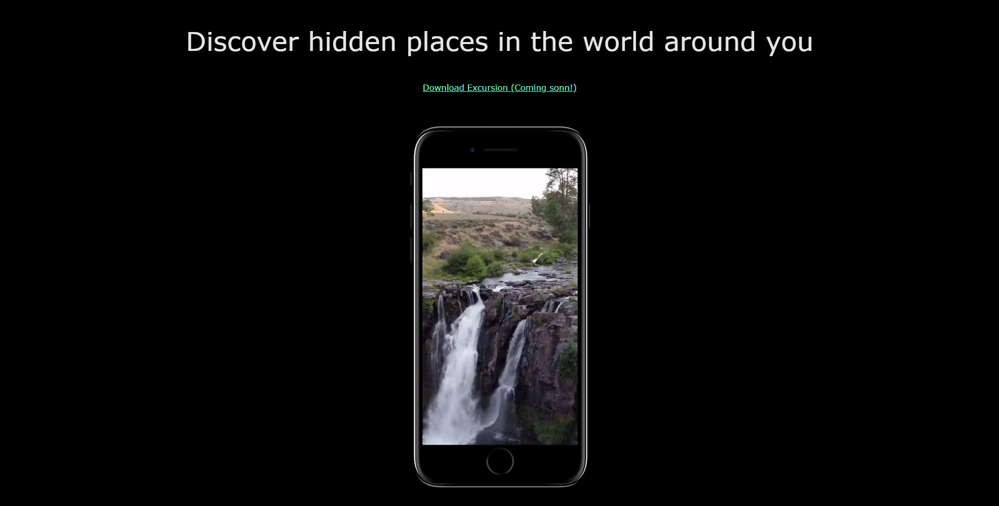

# Excursion Website - Learning project

This is an HTML and CSS project from [Codecademy Full-Stack Career-path](https://www.codecademy.com/learn/paths/full-stack-engineer-career-path), Part 9: Bringing Your Site Online.

## Run

To run on your local machine you just have to open `index.html` in a browser. This webpage is deployed to [02rasjac.github.io/excursion](https://02rasjac.github.io/excursion/)

